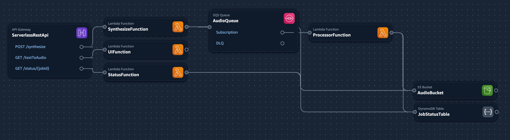

# aws-polly-service-test

AWS SAM application for text to audio conversion using AWS Polly.

The application uses the following AWS resources
* **AWS Polly** to convert text to speech
* **Lambda** function to serve simple test UI
* **SQS queue** to queue text to speech conversion jobs
* **Lambda** function to process jobs from SQS queue
* **DynamoDB** table to store job status
* **S3 bucket** to store audio files




## Deploy the sample application
You need sam CLI and the following tools to build and deploy this app.

* SAM CLI - [Install the SAM CLI](https://docs.aws.amazon.com/serverless-application-model/latest/developerguide/serverless-sam-cli-install.html)
* Node.js - [Install Node.js 20](https://nodejs.org/en/),
* Docker - [Install Docker community edition](https://hub.docker.com/search/?type=edition&offering=community)

To build and deploy your application for the first time, run the following in your shell:

```bash
sam build

sam deploy
# or
sam deploy --guided
```

After deploying you will be shown URLs for the API and UI. Use them to test the application.

## Use the SAM CLI to build and test locally

Since this sample uses Queue, its best to test in AWS directly. However, you can test the API locally using the following commands:

```bash
$ sam local invoke SynthesizeFunction --event events/synthesize.json
```

```bash
$ sam local start-api
$ curl -X POST -H "Content-Type: application/json" -d '{"text": "Hello"}' http://localhost:3000/synthesize
```

## Cleanup

To delete the cloudformation stack from AWS :

```bash
sam delete --stack-name aws-polly-service-test
```
